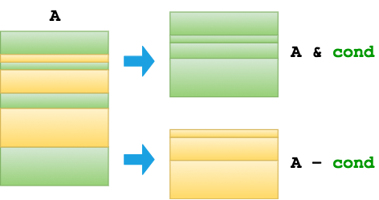
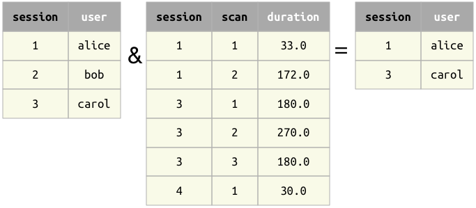
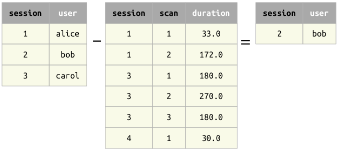

# Restriction

## Restriction operators `&` and `-`

The restriction operator `A & cond` selects the subset of entities from `A` that meet 
the condition `cond`.
The exclusion operator `A - cond` selects the complement of restriction, i.e. the 
subset of entities from  `A` that do not meet the condition `cond`.

Restriction and exclusion.

{: style="width:400px; align:center"}

The condition `cond` may be one of the following:

+ another table
+ a mapping, e.g. `dict`
+ an expression in a character string
+ a collection of conditions as a `list`, `tuple`, or Pandas `DataFrame`
+ a Boolean expression (`True` or `False`)
+ an `AndList`
+ a `Not` object
+ a query expression

As the restriction and exclusion operators are complementary, queries can be 
constructed using both operators that will return the same results.
For example, the queries `A & cond` and `A - Not(cond)` will return the same entities.

## Restriction by a table

When restricting table `A` with another table, written `A & B`, the two tables must be 
**join-compatible** (see `join-compatible` in [Operators](./operators.md)).
The result will contain all entities from `A` for which there exist a matching entity 
in `B`.
Exclusion of table `A` with table `B`, or `A - B`, will contain all entities from `A` 
for which there are no matching entities in `B`.

Restriction by another table.

{: style="width:546px; align:center"}

Exclusion by another table.

{: style="width:539px; align:center"}

### Restriction by a table with no common attributes

Restriction of table `A` with another table `B` having none of the same attributes as 
`A` will simply return all entities in `A`, unless `B` is empty as described below.
Exclusion of table `A` with `B` having no common attributes will return no entities, 
unless `B` is empty as described below.

Restriction by a table having no common attributes.

{: style="width:571px; align:center"}

Exclusion by a table having no common attributes.

{: style="width:571px; align:center"}

### Restriction by an empty table

Restriction of table `A` with an empty table will return no entities regardless of 
whether there are any matching attributes.
Exclusion of table `A` with an empty table will return all entities in `A`.

Restriction by an empty table.

{: style="width:563px; align:center"}

Exclusion by an empty table.

{: style="width:571px; align:center"}

## Restriction by a mapping

A key-value mapping may be used as an operand in restriction.
For each key that is an attribute in `A`, the paired value is treated as part of an 
equality condition.
Any key-value pairs without corresponding attributes in `A` are ignored.

Restriction by an empty mapping or by a mapping with no keys matching the attributes in 
`A` will return all the entities in `A`.
Exclusion by an empty mapping or by a mapping with no matches will return no entities.

For example, let's say that table `Session` has the attribute `session_date` of :ref:`datatype <datatypes>` `datetime`.
You are interested in sessions from January 1st, 2018, so you write the following 
restriction query using a mapping.

```python
Session & {'session_date': "2018-01-01"}
```

Our mapping contains a typo omitting the final `e` from `session_date`, so no keys in 
our mapping will match any attribute in `Session`.
As such, our query will return all of the entities of `Session`.

## Restriction by a string

Restriction can be performed when `cond` is an explicit condition on attribute values, 
expressed as a string.
Such conditions may include arithmetic operations, functions, range tests, etc.
Restriction of table `A` by a string containing an attribute not found in table `A` 
produces an error.

```python
# All the sessions performed by Alice
Session & 'user = "Alice"'

# All the experiments at least one minute long
Experiment & 'duration >= 60'
```

## Restriction by a collection

A collection can be a list, a tuple, or a Pandas `DataFrame`.

```python
# a list:
cond_list = ['first_name = "Aaron"', 'last_name = "Aaronson"']

# a tuple:
cond_tuple = ('first_name = "Aaron"', 'last_name = "Aaronson"')

# a dataframe:
import pandas as pd
cond_frame = pd.DataFrame(
               data={'first_name': ['Aaron'], 'last_name': ['Aaronson']})
```

When `cond` is a collection of conditions, the conditions are applied by logical 
disjunction (logical OR).
Thus, restriction of table `A` by a collection will return all entities in `A` that 
meet *any* of the conditions in the collection.
For example, if you restrict the `Student` table by a collection containing two 
conditions, one for a first and one for a last name, your query will return any 
students with a matching first name *or* a matching last name.

```python
Student() & ['first_name = "Aaron"', 'last_name = "Aaronson"']
```

Restriction by a collection, returning all entities matching any condition in the collection.

{: style="align:center"}

Restriction by an empty collection returns no entities.
Exclusion of table `A` by an empty collection returns all the entities of `A`.

## Restriction by a Boolean expression

`A & True` and `A - False` are equivalent to `A`.

`A & False` and `A - True` are empty.

## Restriction by an `AndList`

The special function `dj.AndList` represents logical conjunction (logical AND).
Restriction of table `A` by an `AndList` will return all entities in `A` that meet 
*all* of the conditions in the list.
`A & dj.AndList([c1, c2, c3])` is equivalent to `A & c1 & c2 & c3`.
Usually, it is more convenient to simply write out all of the conditions, as 
`A & c1 & c2 & c3`.
However, when a list of conditions has already been generated, the list can simply be 
passed as the argument to `dj.AndList`.

Restriction of table `A` by an empty `AndList`, as in `A & dj.AndList([])`, will return 
all of the entities in `A`.
Exclusion by an empty `AndList` will return no entities.

## Restriction by a `Not` object

The special function `dj.Not` represents logical negation, such that `A & dj.Not(cond)` 
is equivalent to `A - cond`.

## Restriction by a query

Restriction by a query object is a generalization of restriction by a table (which is 
also a query object), because DataJoint queries always produce well-defined entity 
sets, as described in  [entity normalization](../design/normalization.md).
As such, restriction by queries follows the same behavior as restriction by tables 
described above.

The example below creates a query object corresponding to all the sessions performed by 
the user Alice.
The `Experiment` table is then restricted by the query object, returning all the 
experiments that are part of sessions performed by Alice.

```python
query = Session & 'user = "Alice"'
Experiment & query
```
